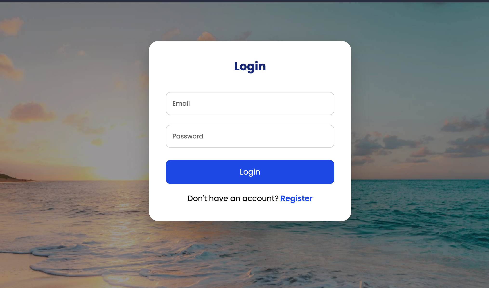
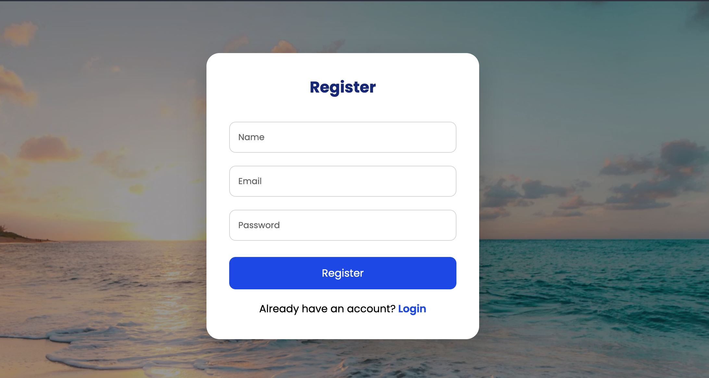
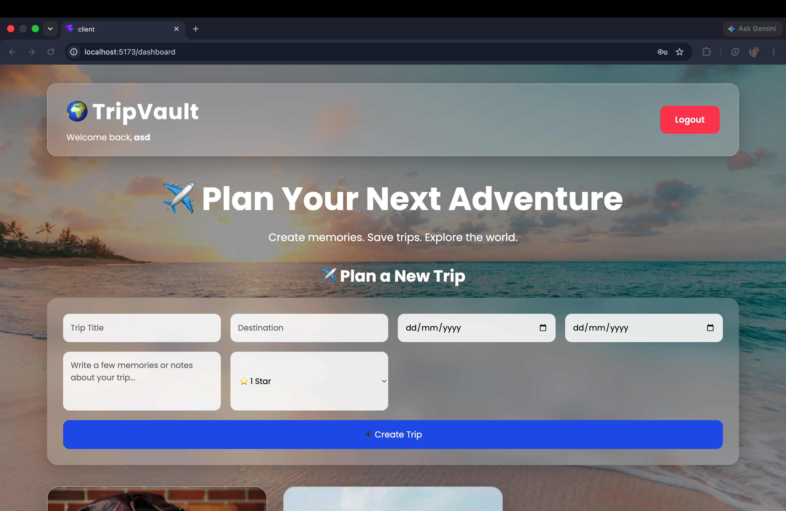
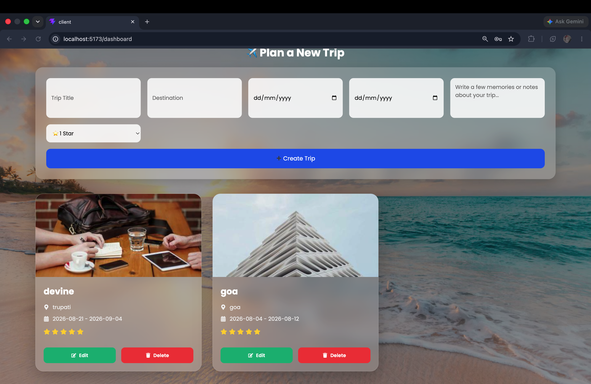
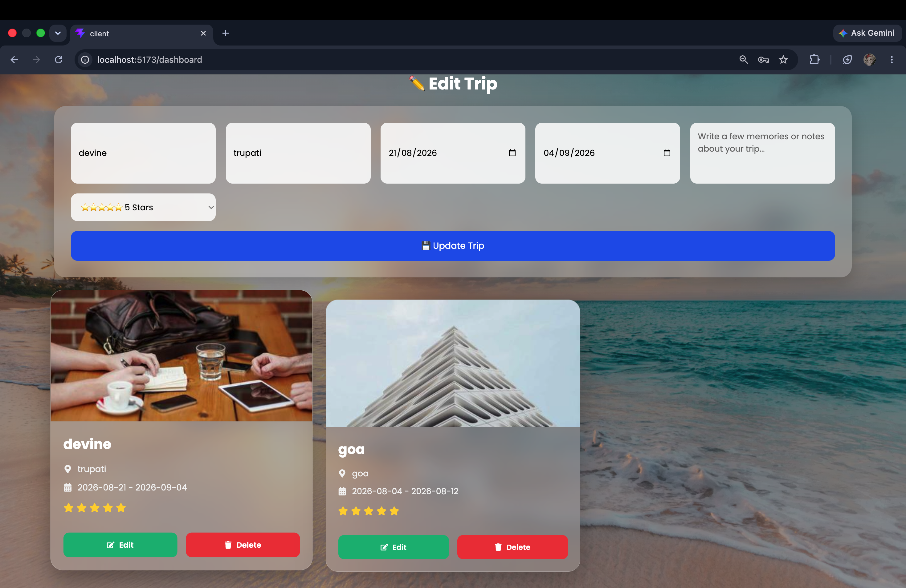

# 🌍 TripVault

TripVault is a full-stack MERN travel management application that allows users to securely manage their travel plans. Users can register, log in, and create, view, update, and delete their personal trips through an intuitive dashboard.

## ✨ Features

- 🔐 User Registration & Login
- 🔑 JWT Authentication
- 🔒 Protected Routes
- 🧳 Create New Trips
- ✏️ Edit Existing Trips
- 🗑️ Delete Trips
- 📋 View All Personal Trips
- ⭐ Trip Rating
- 📅 Trip Date Management
- 📱 Responsive User Interface
- 🎨 Modern Glassmorphism Design

---

## 🛠️ Tech Stack

### Frontend
- React.js
- Vite
- Axios
- React Router DOM
- React Icons
- CSS3

### Backend
- Node.js
- Express.js
- MongoDB Atlas
- Mongoose
- JWT Authentication
- bcryptjs

---

## 📂 Project Structure

```
TripVault
│
├── client
│   ├── src
│   ├── public
│   └── package.json
│
├── server
│   ├── config
│   ├── controllers
│   ├── middleware
│   ├── models
│   ├── routes
│   ├── utils
│   └── package.json
│
└── README.md
```

---

## 🚀 Application Workflow

1. Register a new account.
2. Log in securely using JWT authentication.
3. Access the protected dashboard.
4. Create and manage travel plans.
5. Edit or delete trips anytime.
6. Logout securely.

---

## 📸 Screenshots

### Login



### Register



### Dashboard



### Trip Management




---

## 🔮 Future Enhancements

- 📷 Upload destination images
- 🌍 Interactive map integration
- 💰 Trip expense tracker
- ☁️ Cloud image storage
- 🔍 Search and filter trips
- ❤️ Favorite destinations
- 📊 Travel statistics dashboard

---

GitHub: https://github.com/ashray0207

LinkedIn: https://www.linkedin.com/in/ashray-patil/

---

## License

This project is developed for learning purposes as part of a MERN Stack Internship assignment.
>>>>>>> 5aa72f5983683e13a643fc512cbccf24104da06d
